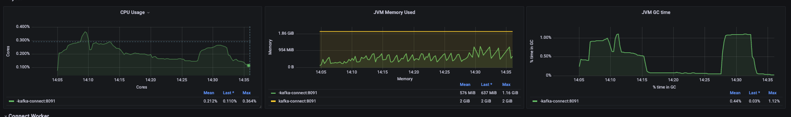
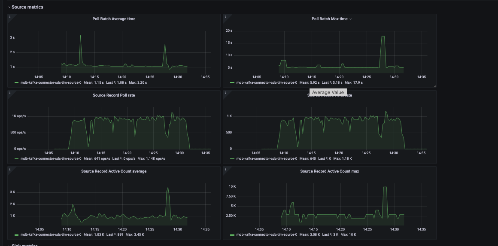

PoC-EndToEnd.md

## PoC MongoDB Kafka Connector End To End Experience.

1.- Writing data to MongoDB

The [mgodatagen tool](https://github.com/feliixx/mgodatagen) writes `1000` documents of `306` bytes bson size each second for `1000` times on `mgodatagen_test.test` namespace running the below command on a `zsh` session.

```
repeat 1000 {time ./mgodatagen -a -f datagen/generators/testdata/ref.json --uri  "mongodb://host.docker.internal:27017,host.docker.internal:27018,host.docker.internal:27019/?replicaSet=replset"; sleep 1s}
```

- mgodatagen output

```
+------------+---------+-----------------+----------------+
| COLLECTION |  COUNT  | AVG OBJECT SIZE |    INDEXES     |
+------------+---------+-----------------+----------------+
| test       | 1700000 |             302 | _id_  26172 kB |
````

- Check the document bson size
```
> use mgodatagen_test
switched to db mgodatagen_test
> Object.bsonsize(db.test.findOne())
306
>
```
- Count value in the `datagen/generators/testdata/ref.json` file allow us to setup the number of inserted document per second
```
[
  {
    "database": "mgodatagen_test",
    "collection": "test",
    "count": 1000,
```

2.- MongoDB Kafka Connector - Source configuration.

Using the [mdb-kafka-connector-cdc-sample github project](https://github.com/esdiegoer/mdb-kafka-connector-cdc-sample), I have deployed the Source Connector for the environment using the below configuration for the `source.json` files.

Setup the `source.json` files with the below parameters.

```
{
"name": "mdb-kafka-connector-cdc-tim-source",
 "config": {
  "connector.class": "com.mongodb.kafka.connect.MongoSourceConnector",
  "connection.uri": "mongodb://host.docker.internal:27017,host.docker.internal:27018,host.docker.internal:27019/?replicaSet=replset",
  "database": "mgodatagen_test",
  "collection": "test"
 }
}
```

Then I run the below `curl` command on a command shell session.
```zsh
curl -s -X POST -H 'Content-Type: application/json' --data @./source.json http://localhost:8083/connectors
```

3.- Check the Kafka topic


* kafka topic description
```
~ ❯ docker exec -it kafka-connect kafka-topics -bootstrap-server=kafka2:19092,kafka3:19093,kafka1:19091 --describe --topic mgodatagen_test.test
Topic: mgodatagen_test.test	PartitionCount: 1	ReplicationFactor: 1	Configs:
	Topic: mgodatagen_test.test	Partition: 0	Leader: 3	Replicas: 3	Isr: 3
~ ❯
```

* Check Kafka Topic New messages.
```
docker exec -it kafka-connect kafka-console-consumer --topic mgodatagen_test.test --bootstrap-server=kafka2:19092,kafka3:19093,kafka1:19091
```

### PoC Result

The monitoring system deployed by the `docker-compose` shows the below results running the PoC with Docker on a MacBook Pro 2019 with Memory 16 Gb. 



During the PoC the Kafka-Connect CPU has consumed less than 0.5 core cpu, running 1000 times 1000 insert operations per second. The document size is 306 bytes.



The above MongoDB Kafka Source Connector metrics correlates the 1k insert operations per seconds in the Kafka Topic.
