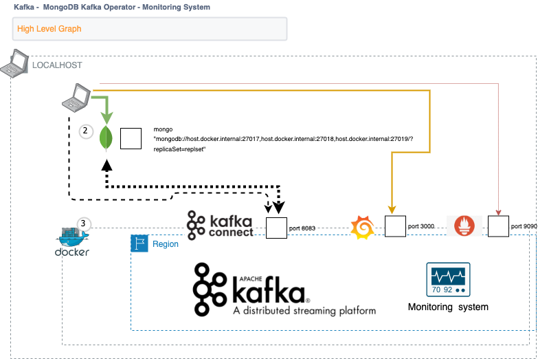
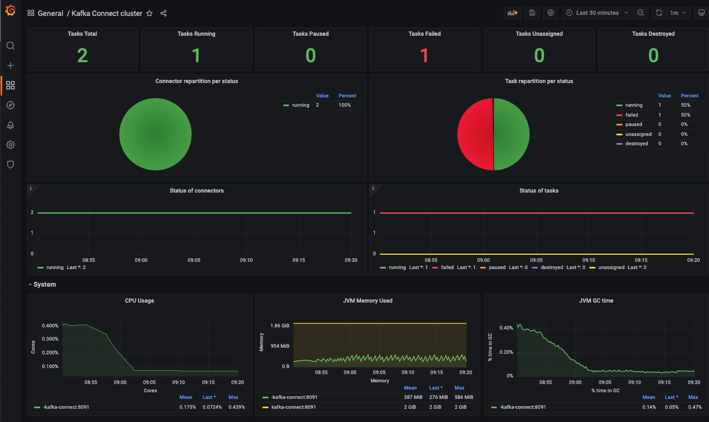
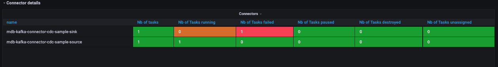
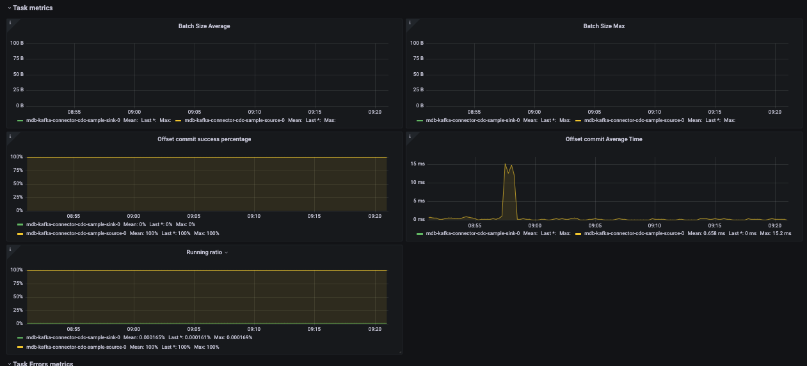
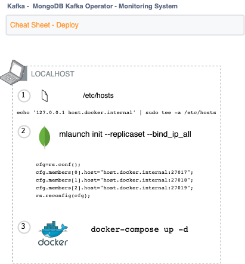
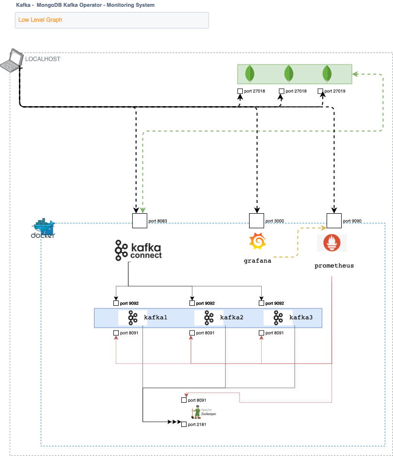

##  1. Description



-  [MongoDB Kafka Connector](https://docs.mongodb.com/kafka-connector/current/) & Kafka repro environment easy to build & destroy.
   - Docker  OS-level and network virtualization isolated from one another and bundle their own software on localhost.

- Visual monitoring system 
  The Monitoring expresses these logs visually, to make analyzing the system more straightforward providing the following monitoring:
  - [MongoDB Kafka Connector](https://docs.mongodb.com/kafka-connector/current/) metrics on Kafka Connect Grafana dashboard.
  - Kafka broker & Zookeeper Grafana dashboards.
  - Monitoring database on Prometheus.

- Communication between Docker and `mlaunch` repro tool.
    - TCP/IP communication between a docker container to localhost MongoDB Replica Set or `mongod` service.

**[MongoDB Kafka Connector](https://docs.mongodb.com/kafka-connector/current/) Monitoring dashboard examples:**

- [MongoDB Kafka Connector](https://docs.mongodb.com/kafka-connector/current/) System metrics.

- [MongoDB Kafka Connector](https://docs.mongodb.com/kafka-connector/current/) Status metrics and alerts.

- [MongoDB Kafka Connector](https://docs.mongodb.com/kafka-connector/current/) Performance Metrics.


### Components

- [Grafana](https://grafana.com/) is open source analytics & monitoring solution for databases.
- [Prometheus](https://prometheus.io/) is an open-source monitoring system with a dimensional data model, flexible query language, efficient time series database and modern alerting approach.
- [Docker](https://www.docker.com/) is a set of products that use OS-level virtualization to deliver software in packages called containers.
- [Apache Kafka](https://kafka.apache.org/) is a framework implementation of a software bus using stream-processing
- [MongoDB](https://www.mongodb.com/) is a source-available cross-platform document-oriented database program

**Pre-requisites**
- 16 Gb RAM.
- Docker.
- MongoDB TSE tool `mlaunch`.
- modify the `/etc/hosts` file.

---------------------------------

## 2. How to deploy...



### MongoDB RS on localhost

Deploy a MongoDB RS in the localhost perform the following action.

- Add ``host.docker.internal`` FQDN to the /etc/hosts file. It will help us to reach to the localhost from the docker container.
```echo '127.0.0.1 host.docker.internal' | sudo tee -a /etc/hosts```
  
-  Once the MOngoDB RS is deployed (`mlaunch init --replicaset --bind_ip_all`) on localhost, you must modify the cfg.member[].host value to ```host.docker.internal:tcp_port``` in the rs.conf file.
  - Create the `update_rs_hostname.js ` file
```                                                                                                               
cfg=rs.conf();
cfg.members[0].host="host.docker.internal:27017";
cfg.members[1].host="host.docker.internal:27018";
cfg.members[2].host="host.docker.internal:27019";
rs.reconfig(cfg);
```
 - Run the below mongo shell with the update_rs_hostname.js script.
```
mongo "mongodb://host.docker.internal:27017,host.docker.internal:27018,host.docker.internal:27019/?replicaSet=replset" update_rs_hostname.js
```

### Docker.
* deploy kafka
```
git clone https://github.com/unai-ss/Kafka-Kconnector-Prometheus-Grafana.git
cd Kafka-Kconnector-Prometheus-Grafana
docker-compose up -d
```
* example output
```
~/Documents/kafkaRepro/ master* ❯ docker ps -a
CONTAINER ID   IMAGE                             COMMAND                  CREATED              STATUS                        PORTS                              NAMES
1687b6a44433   grafana/grafana                   "/run.sh"                About a minute ago   Up About a minute             0.0.0.0:3000->3000/tcp             grafana
3142973f41e9   cdc-tutorial-connect-1.6.1:1.0    "/etc/confluent/dock…"   About a minute ago   Up About a minute (healthy)   0.0.0.0:8083->8083/tcp, 9092/tcp   connect
acbc6baa7e2c   prom/prometheus                   "/bin/prometheus --c…"   About a minute ago   Up About a minute             0.0.0.0:9090->9090/tcp             prometheus
069f80624359   confluentinc/cp-server:5.5.0      "/etc/confluent/dock…"   About a minute ago   Up About a minute             0.0.0.0:9091->9091/tcp, 9092/tcp   kafka1
b5094329565f   confluentinc/cp-server:5.5.0      "/etc/confluent/dock…"   About a minute ago   Up About a minute             9092/tcp, 0.0.0.0:9093->9093/tcp   kafka3
78bb3da22664   confluentinc/cp-server:5.5.0      "/etc/confluent/dock…"   About a minute ago   Up About a minute             0.0.0.0:9092->9092/tcp             kafka2
97fb7c166a97   confluentinc/cp-zookeeper:5.5.0   "/etc/confluent/dock…"   About a minute ago   Up About a minute             2181/tcp, 2888/tcp, 3888/tcp       zookeeper1
```

### Kafka-Connect Connection example

```
~/Documents/kafkaRepro/ master* ❯ docker exec -it kafka-connect curl -s "http://localhost:8083" | jq .                                    09:37:05 AM
{
  "version": "7.0.0-ccs",
  "commit": "c6d7e3013b411760",
  "kafka_cluster_id": "rIGdWbSuQYyuPScFxskMiw"
}
~/Documents/kafkaRepro/ master* ❯ docker exec -it kafka-connect curl -s "http://localhost:8083/connectors" | jq .                         09:38:25 AM
[]
~/Documents/kafkaRepro/ master* ❯
```

## Monitoring System
* user admin / pass admin
* link [http://localhost:3000](http://localhost:3000)

### dashboards
 - Kafka-Connector Overview.
 - Kafka Overview.
 - Zookeeper Overview.

## Example.

## MongoDB Kafka Connector tutorial.

Those are easy guidelines adapting the `Replicate Data with a Change Data Capture Handler` to the current infra.

1.- Create CDCTutorial.Source and CDCTutorial.Destination namespaces.
```
mongo "mongodb://host.docker.internal:27017,host.docker.internal:27018,host.docker.internal:27019/?replicaSet=replset"
```
```
use CDCTutorial
db.createCollection("Source")
```

2.- Deploy Source Connector on connect docker container
```
docker exec -it kafka-connect curl -X POST -H "Content-Type: application/json" --data '{ "name": "mongo-source-CDCTutorial-eventroundtrip", "config": { "connector.class": "com.mongodb.kafka.connect.MongoSourceConnector", "connection.uri": "mongodb://host.docker.internal:27017,host.docker.internal:27018,host.docker.internal:27019/?replicaSet=replset", "database": "CDCTutorial", "collection": "Source"} }' http://localhost:8083/connectors -w "\n" | jq .
```
```
docker exec -it kafka-connect curl -X POST -H "Content-Type: application/json" --data '{ "name": "mongo-sink-CDCTutorial-eventroundtrip", "config": { "connector.class":"com.mongodb.kafka.connect.MongoSinkConnector", "tasks.max":"1", "topics":"CDCTutorial.Source", "change.data.capture.handler":"com.mongodb.kafka.connect.sink.cdc.mongodb.ChangeStreamHandler", "connection.uri":"mongodb://host.docker.internal:27017,host.docker.internal:27018,host.docker.internal:27019/?replicaSet=replset", "database":"CDCTutorial", "collection":"Destination"}}' http://localhost:8083/connectors -w "\n" | jq .
```
3.- Connectors Status and Info
```
docker exec -it kafka-connect curl -s http://localhost:8083/connectors
docker exec -it kafka-connect curl -s "http://localhost:8083/connectors?expand=info&expand=status" | jq '.[] | "\(.info.name) \(.status.connector.state) \(.status.tasks)"'
```
4.- Kafka list topics
```
docker exec -it kafka-connect kafka-topics -bootstrap-server=kafka2:19092,kafka3:19093,kafka1:19091 --list
```
5.- Kafka Status
* Read the Topic consumer
```
docker exec -it kafka-connect kafka-console-consumer --topic CDCTutorial.Source --from-beginning --bootstrap-server=kafka2:19092,kafka3:19093,kafka1:19091
```
* Write on the Topic producer
```
docker exec kafka-connect kafka-console-producer -bootstrap-server=kafka2:19092,kafka3:19093,kafka1:19091 --topic mdbtsedb.source
```
6.- Changes on CDCTutorial.Source namespace
```bash
mongo "mongodb://host.docker.internal:27017,host.docker.internal:27018,host.docker.internal:27019/?replicaSet=replset"
```

```js 
use CDCTutorial
db.Source.insert({proclaim: "Hello World!"});
```

### Grafana

[http://localhost:3000/login]

### Prometheus
* graph
[http://localhost:9090/graph]
* status prometheus endpoints
[http://localhost:9090/targets]

## Troubleshooting
output A
```
docker exec -it kafka-connect curl -s "http://localhost:8083/connectors" | jq '.[]'| xargs -I{connector_name} curl -s "http://localhost:8083/connectors/"\{connector_name\}"/status" | jq -c -M '[.name,.connector.state,.tasks[].state]|join(":|:")' | column -s : -t | sed 's/\"//g' | sort
mongo-sink-CDCTutorial-eventroundtrip    |  RUNNING  |  RUNNING
mongo-source-CDCTutorial-eventroundtrip  |  RUNNING  |  RUNNING
```


## 3.- Info



### Tools

- Kafka Deployment
 - 3 Kafka Broker, 1 Zookeeper
 - Kafka Connect including MongoDB Kafka Connector 1.6
 - Monitoring System 
   - Grafana
     - Kafka Connector, Kafka Connect, Kafka, Zookeeper monitoring Graph templates
   - Prometheus
     - Monitoring DB


### Disclaimer

> This project uses code from other sources.